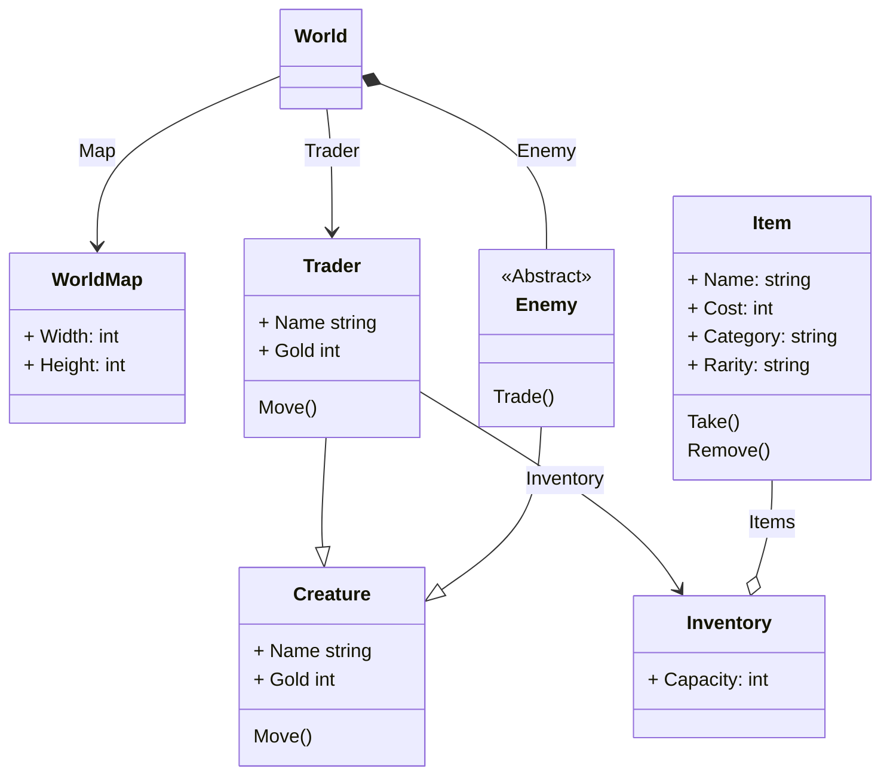

```mermaid
classDiagram

    class WorldMap{
        + Width: int
        + Height: int
    }

    class Creature{
        + Name string
        + Gold int
        Move()
    }

    class Trader{
        + Name string
        + Gold int
        Move()
    }

    class Enemy {
        <<Abstract>>
        Trade()
    }

    class Inventory {
        + Capacity: int
    }

    class Item {
        + Name: string
        + Cost: int
        + Category: string
        + Rarity: string
        Take()
        Remove()
    }

    Trader --|> Creature
    Enemy --|> Creature
    Trader --> Inventory : Inventory
    Item --o Inventory : Items

    World --> Trader : Trader
    World *-- Enemy : Enemy
    World --> WorldMap : Map
```